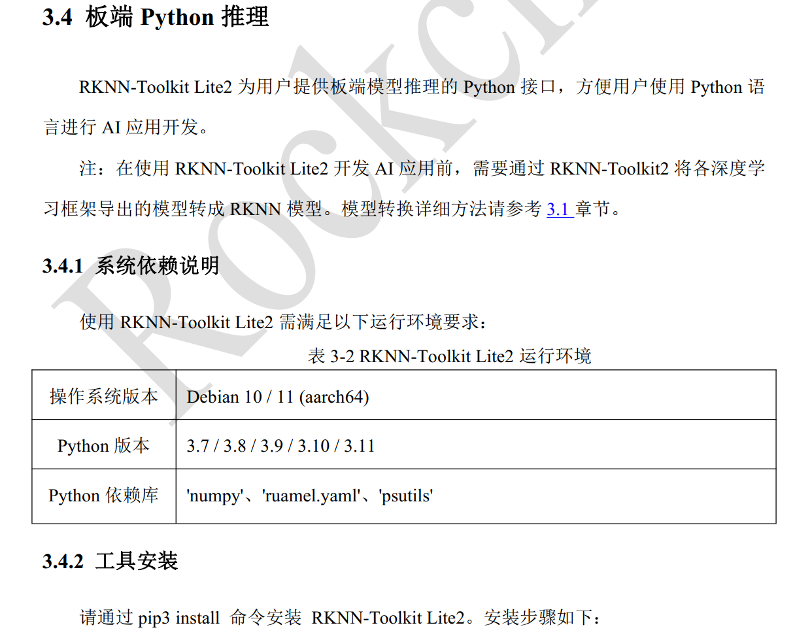

# ROS node YOLOV8 seg on rk3588

## Overview

a pkg using npu on rk3588 for REALTIME yolo seg 

## Requirements

- rknn model, for inference
- rk3588
- any rgbd cam

## Installation
### Preparation
1. download onnx model 
from rknn model zoo  https://github.com/rockchip-linux/rknn-toolkit2/tree/master/rknn_toolkit_lite2/packages
or export from ultralytics  https://docs.ultralytics.com/modes/export/#usage-examples


2. transform to rknn format
https://github.com/airockchip/rknn_model_zoo/blob/main/examples/yolov8_seg/README.md#4-convert-to-rknn

3. install appropriate whl
for rk3588 aarch64, choose `rknn_toolkit_lite2` https://github.com/rockchip-linux/rknn-toolkit2/tree/master/rknn_toolkit_lite2/packages


### About pkg
1. Clone this repository into your workspace.
2. Build the package using `colcon build --packages-select yolov8_seg `.
3. Source the setup file: `source install/setup.bash`.

## Usage

```
ros2 run yolov8_seg infer_node
```